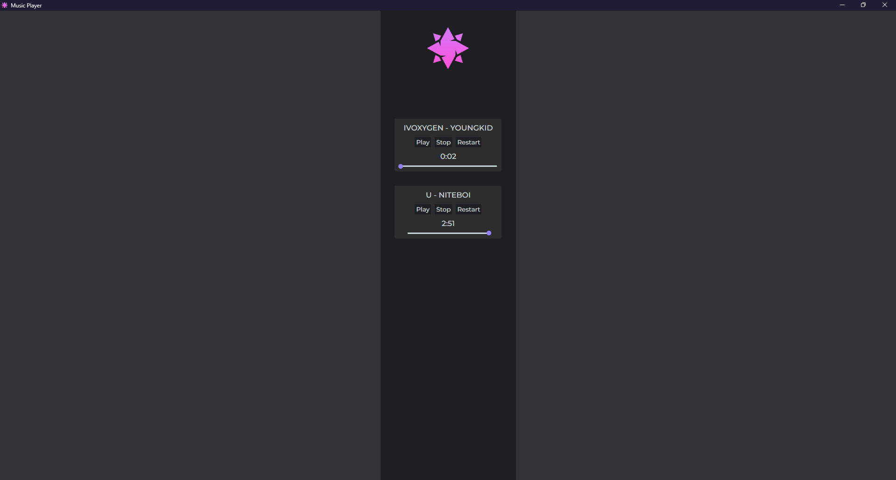

# web-music-player
Music Player On Electron JS

# How to install

# First 
## Clone This Repo
 * type `git clone https://github.com/aovent/web-music-player.git`
 * type `npm install`
 * load your tracks in `folder`
 * type `npm start`

# First Version Banner

